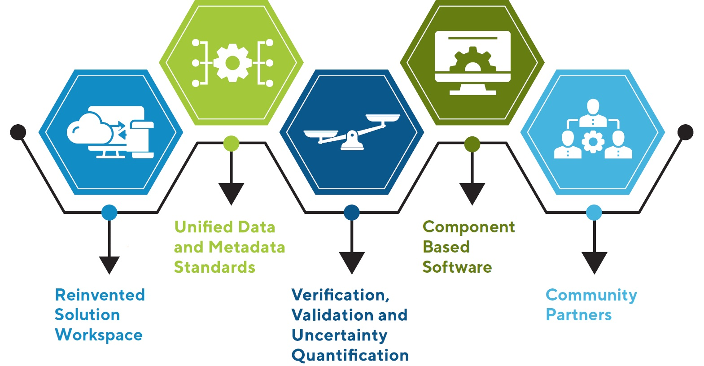

# Numerical Technology Modernization Strategy

Version: 1.0.0  
Date: 2019  
Written by: Chris Massey (Chris.Massey@usace.army.mil)

## Introduction

This is a living document, intended for continuous review and updating, at least annually, as progress is made on the implementation of the NTMS and as new technologies emerge. While the NTMS started within CHL, success in implementing the strategy will only be realized with the participation of other ERDC labs, USACE districts, as well as partner federal agencies.

The numerical technology modernization strategy strengthens the entire coastal and hydraulics enterprise by equipping practitioners with the best numerical tools available. In so doing, it will perpetuate CHL as a continued leader in pioneering coastal and hydraulic numerical technology research and development and will integrate expertise and resources across business, program, and organizational lines. Numerical models are increasingly seen as a commodity, particularly in an ever-increasing open source development culture, and this strategy will guide CHL within this culture, to relentlessly pursue collaborations in development of leading edge technologies. CHL will work alongside our partners to transition state-of-the-art to state-of-the-practice through enhanced customer support and technology transfer efforts.

In this document, the word “technologies” is used to encompass models, tools, data and information technology (IT) infrastructure. ”Models” refers to numerical computer algorithms, e.g. computer software that solves systems of equations. “Tools” refers to mechanisms that access, create, and/or manipulate data, such as graphical users interfaces (GUIs) and cloud/web-based calculators. “Information Technology (IT) infrastructure” refers to computing hardware systems, data storage systems and internet access/bandwidth. Support software and project management software, such as “git” for version control and “Jira” for project management software, overlaps both Tools and IT infrastructure.

The three pillars of the NTMS are component-based community software; seamlessly integrated data and models; and cloud/web-based infrastructure/tools. These components are reinforced and interconnected with an integrated verification, validation and uncertainty quantification (VVUQ) process. The VVUQ process continually ensures the integrity of the components and indicates directions for needed research and development improvements. The strategy seeks to layout the necessary foundations for integrating the three pillars to achieve a reinvented solution workspace that has both process driven computational capabilities and data that are seamlessly interchanged and are cloud environment enabled. The workspace refers to more than the tools, e.g. interfaces, and data, it also encompasses the workflow processes as well as the access to and resources upon which everything is executed and stored, e.g. infrastructure. The seamless interchange between models, tools, and data requires that all are readily accessible across operating platform environments, which is particularly relevant in light of big data analytics. The user experience will evolve into a model agnostic interface that is customizable, yet familiar and is integrated with best practices and USACE guidance documents along with training and user manuals. In order to be accepted and trusted by the end users, these technologies must first be accurate and robust, have appropriate user support and training, and be well validated and verified for the problems they are solving.

The NTMS can be broken down into five major action areas:


```{r, fig.cap=""}

```


Teams have been formed for each of the first four major areas in order to further flesh out details and needs, and then make recommendations and resource estimates for implementing the strategy in a series of plans. Community partners will be engaged to expand the strategy and to help formulate plans for implementing it. The five action areas are described in the remaining sections of this document.


## Reinvented solution workspace

The purpose of having a reinvented solution workspace is to transform the current models, tools, e.g. interfaces, and workflows into a common environment that operates on anticipated future computational resources, including cloud environments. Furthermore, it will have a common look and feel to modeling and data processes across the spectrum of modeling, which reduces learning curves. At the same time, the new workspace allows for customizable workflows that are in line with USACE guidance and community best practices. The new workspace is required because how we as a community of practice interact with models and data in the future will be very different than today. Big data, the computational complexity of modeling systems of systems, and the proliferation of portable handheld devices are driving forces moving the community toward cloud-based computing and web/app-based applications. Our tools must be collocated with future computation resources and allow ready access to required data, both inputs and outputs.

To create this new paradigm, new tools for model/data interaction are required. These requirements are in part responsible for the need to implement the other components of the NTMS. For example, using unified data and metadata standards for stored data and for use in both complex numerical models and simpler on-line tools, helps to facilitate a model agnostic interface and reduce workflow complexities by removing reformatting. This model agnostic interface is a significant part of the design concept for the new workflow.


```{r echo=FALSE}
#Create empty table
Table01 <- as.data.frame(matrix(NA, nrow = 5, ncol = 2))
colnames(Table01) <- c("", "")

#Specify rows of the table
Table01[1,] <- c("1.", "Common environment (cloud)")
Table01[2,] <- c("2.", "Seamless model-data interaction")
Table01[3,] <- c("3.", "Model agnostic interface")
Table01[4,] <- c("4.", "Customizable workflows")
Table01[5,] <- c("5.", "Integrated with guidance documents")

#Send output table rows into a single matrix
rownames(Table01) <- NULL
knitr::kable(Table01, caption="Dimensions of a reinvented solution workspace.", align="l") 
```


Each of the individual components will have a similar look and feel with a common branding, a unified naming convention that is not tied to an organization. A new common branding for the workspace solutions does not mean that existing names of models/tools will change. To illustrate suppose that WIDGIT is the common branding name, then WIDGIT-Hydro would be the name of the process-based workflow that solves the shallow water equations. That workflow would use existing models like ADCIRC, AdH, and CMS-Flow as the solution engines. Each of those models have varying degrees of fidelity, speed of computation, uncertainty, and complexity of setup and execution. The new processed based workflow WIDGIT-Hydro and the new interface would eliminate the user from having to deal with individual model specific requirements. The new interface must also be configurable and allow individual processes to be linkable by the users in a customizable way. The workspace must have readily available preconfigured coupled workflows that exist as selectable options. These workflows will be informed by and comply with USACE guidance and best practice procedures. With these preexisting workflows, the reinvented solution workspace can have a question and answer process that leads a user through a series of guided questions to determine not only the correct process to use, but also the appropriate “modules” to apply based on specified error tolerances and desired level of effort. Expert users would still have the ability to select specific models for use instead of being guided.

For this new workspace to be realized, numerical models and tools will be platform independent in their execution. Specifically, large operational numerical models need flexibility to be compiled and run under native operating systems, such as Windows, Mac OS, and Unix/Linux. The models will have a common file type and data structures to aid in data exchanges. They will be designed or re-designed to be scriptable and callable so that they can be incorporated into larger workflows by coupling and integration with other applications and be executable under or through web-based applications. Each model and tool will be analyzed consistently, fairly, and expertly for accuracy and applicability to target problems to aid the model/data selection process. Furthermore, metrics are required to evaluate the complexity and skill sets needed for setting up and executing the appropriate workflows to solve engineering problems. Having such metrics and measures will facilitate filtering of workflow components for different applications and budgets.

These are just a few highlights of the traits and capabilities of the reinvented solution workspace of the future and some of the changes needed to achieve it. A whitepaper is currently being developed, led by a team of experts from CHL with input from users both within USACE districts and from external partners, in order to develop plans for implementation, particularly the workspace interfaces. The whitepaper will also document what has worked well with existing user interfaces, their development process and their user tech support procedures. In this way, best practices can be maintained and carried forward. It is anticipated that external partners will help to advance these new technologies through open-source licenses and peer-reviewed and refereed processes.

## Unified data and metadata standards

The purpose of the unified data/metadata standards is first to make files self-describing in content and structure to ensure details about the file contents are known, allowing users to make informed decisions about the suitable use of the data. Secondly, when fully implemented, the standards will facilitate certain types of numerical model coupling, make them easier to use and more transportable. A unified data structure means a single file-type/format and a commonly adopted single method for describing and writing the data in the file. Using a unified data structure will allow each model to be capable of reading and writing a file that is immediately recognizable and usable to other models of similar types. It also means that interfaces and downstream products and applications, like the Coastal Hazards System (CHS), do not require the data to be reformatted prior to use and can have access to many more data sources than are currently available. The use of the Network Common Data Form (NetCDF) file types has been adopted as a common starting point along with the adoption of the Climate-Forecast (CF) Standards for metadata and file structures (CF-Conventions, 2020). The NetCDF4 (Unidata, 2020) library is readily available across multiple computing platforms, which allows for easier porting and exchange of files. It is designed to read and write data in a well-defined and structured way. Various other federal agencies including the National Oceanic and Atmospheric Administration (NOAA) and the United States Geological Survey (USGS) have adopted NetCDF file types. Metadata details all aspects of a data type and a file in such a way that a user or a software suite can understand the contents of the file and have information about when, where, and how the data were produced.

Standard naming conventions aid in removing uncertainty in the meaning of a data variable and allows for easier discovery of data within a given file by automated systems.

The unified data integration team has recommended that metadata inclusion be broken down into three classifications:  

```{r echo=FALSE}
#Create empty table
Table02 <- as.data.frame(matrix(NA, nrow = 3, ncol = 2))
colnames(Table02) <- c("", "")

#Specify rows of the table
Table02[1,] <- c("1.", "Required values")
Table02[2,] <- c("2.", "Referred values")
Table02[3,] <- c("3.", "Optional values")

#Send output table rows into a single matrix
rownames(Table02) <- NULL
knitr::kable(Table02, caption="Classifications of metadata inclusion.", align="l") 
```

This tiered strategy is aimed at making sure the most important metadata gets included in every file so that data are not rendered useless if it is missing. For example, having calculated solution values from a numerical model, but not knowing their coordinate system, units of measure and quality control ratings can render the data useless, while not knowing the date the model was executed is less critical.

The unified data integration team is working on a series of whitepapers to specify a standardized format for data types, e.g., waves, circulation hydrodynamics, sediments, water quality and species, in collaboration with the Environmental Lab, to document standards for metadata inclusion. The documentation for waves is the first set of guidelines to be developed and is currently being refined (August/September 2020). Circulation hydrodynamics is next to be completed in (September/October 2020), and the other process guideline whitepapers will be completed by December of 2020.

## Verification, validation and uncertainty quantification

There is an old saying attributed to George Box (1978) "Models, of course, are never true, but fortunately it is only necessary that they be useful." The purpose of VVUQ is to document model accuracy and uncertainty. Ensuring models are solving what they claim they are solving is paramount in building trust in their application. Verification determines if the computational model fits the mathematical description of the process while validation is performed to determine if the model accurately represents the real world application. Robert O’Keefe and Daniel O’Leary (1993) give a simple yet very useful definition of the two as “Verification refers to building the system right, while validation refers to building the right system.” Uncertainty quantification attempts to quantitatively identify, classify, estimate, and when possible reduce uncertainties in both numerical models and measured/collected data. Philip Stark (Stark, 2017) describes it this way, “UQ tries to appraise and quantify the uncertainty of models of physical systems, which are calibrated to noisy data (and of predictions from those models), including contributions from incomplete knowledge of a process; systematic and stochastic measurement error; limitations of theoretical models; limitations of numerical representations of those models; limitations of the accuracy and reliability of computations, approximations, and algorithms; and human error.“

Since models are continually being developed, improved and otherwise changed, and the same for data collection methods, it is important to have procedures in place that can assess the impacts of changes. For numerical models, it is important to be sure that software changes have not broken the model so that it no longer executes, or worse, executes and produces wrong or unintended results. When new/different instruments are used to collect measured data, it is important to know how the error tolerances (precision of the instrument) in the new systems differ from the old system. As part of the NTMS, automated software regression tools will be implemented along with version control software and repositories to keep track of code changes and generate alerts to changes in software performance.

The Verification, Validation and Uncertainty Quantification (VVUQ) team sent out a survey to team leads for all major CHL developed and used numerical models. The survey captured existing VVUQ processes and cases for each of the models. The results of that survey were summarized into a whitepaper in March 2019, and the survey results serve as a jumping off point for developing a detailed and comprehensive set of procedures and metrics for implementing standardized and consistent VVUQ process for all models. These test cases are physics-based and not just model-based. They will consider the full range of VVUQ from analytic to lab and field tests including the Model Testbed work (Bak, 2016) at the Field Research Facility (FRF). Some of the VVUQ test cases can also double as training materials for the process models and will facilitate the automated regression testing capabilities. These automated regression test are typically performed on regular schedules, sometimes nightly, and will be required to be performed and documented as part of any new release versions of codes, both complex models and simpler one-line tools. Furthermore, software developers would apply these tests frequently while making code changes or implementing existing codes on new platforms.

## Component based software

The **purpose of component-based software is to design and organize numerical codes into process based functions and routines**, in order to streamline changes and updates to large numerical codes, as well as to share and take advantage of common process libraries. Whether large or small, having numerical codes organized into single processes or functions makes them easier to debug and update. Furthermore, models should be broken down into three main tasking phases: initialization, run, and finalization.


```{r echo=FALSE}
#Create empty table
Table03 <- as.data.frame(matrix(NA, nrow = 3, ncol = 2))
colnames(Table03) <- c("", "")

#Specify rows of the table
Table03[1,] <- c("1.", "Modular code - process based design")
Table03[2,] <- c("2.", "Use of community software libraries")
Table03[3,] <- c("3.", "Coupling framework ready")

#Send output table rows into a single matrix
rownames(Table03) <- NULL
knitr::kable(Table03, caption="Dimensions of component based software.", align="l") 
```

Initialization is the startup process in which variables are typically setup and sized properly and other onetime execution events happen. The run phase is the main component or purpose of the model and is one that might get repeated many times in an overall simulation. The finalization phase is where the model resources are deallocated and the model shuts down in a controlled process. The phased approach also aids in the models being called by external models, which is very useful in model coupling and other scriptable procedures. Having models further broken down into process level components can allow for reuse of code and build interchangeable process libraries. For example, making use of the general ocean turbulence model (GOTM) library in three-dimensional circulation models, or matrix solvers packages like the Portable, Extensible Toolkit for Scientific Computation (PETSc), can increase model solution accuracies while decreasing model development times. In the same fashion, development of libraries, or process-based components, allows updates to be implemented quickly into models using them.

The component-based software team developed a whitepaper in March 2019 that outlines possible process level modules (sediments, meteorology, turbulence, friction, etc.) that are common to several numerical technologies and that could be developed into standalone libraries that are then called by individual models. The whitepaper also details other important modern software practices such as the ability of models to be linked with other models via a coupling framework like the Earth System Modeling Framework (ESMF) and the Coastal Storm Modeling Systems Coupling Framework. Some numerical models have already implemented portions, but not all, of these practices while others will require substantial code rewrites to become fully compliant with such practices. The whitepaper also details some of those specific requirements. The team will work with individual model leads/developers to outline a comprehensive work plan and detailed resource needs for each model to become fully compliant.


## Community partners

While CHL is initiating the first version of the NTMS and beginning to develop plans for implementing portions of the strategy, it is **highly desirable that the strategy become a community strategy**. Other ERDC labs, USACE districts and centers of expertise are especially important partners. Sister federal organizations such as the National Oceanic and Atmospheric Administration (NOAA), the U.S. Geological Survey (USGS) and the U.S. Bureau of Reclamation (USBR) have overlapping modeling needs with those of CHL and in some cases use the same numerical models. Even if individual models are shared, the workflows and data standards are not the same, nor are the tools accessing them. **Development is also not traditionally coordinated. Using open source development, unified data standards, community accepted test cases and following a common strategy to guide current and future developments**, not only makes good sense, it makes good use of limited resources. Our federal partners are invited to join in refining the NTMS and in helping to formulate plans for implementation. This is somewhat happening now with the partnership at the National Water Center through the Coastal Coupling Community of Practice and recent meetings about the next generation National Water Model, as well as co-development on both ADCIRC and WaveWatch III models.

Other partners could be from the Department of Defense (DoD) to include the Army, Navy and Air Force as well as the DoD’s High Performance Computing (HPC) Modernization Program’s CREATE, which stands for Computational Research and Engineering Acquisition Tools and Environments. The CREATE program is designed to improve the DoD’s acquisition process by developing and deploying advanced computational engineering design tools for acquisition programs within military aircraft design; military ship design; RF antenna designs and their integration with platforms; and military ground vehicle designs. The program has flexible operating platforms on the DoD HPC environment as well as a web-based portal. Currently, CHL and the CREATE program leads are exploring ways to work together.

Academic partnerships are also desirable for many reasons. With academia’s help, models and tools can be co-developed allowing government and industry users’ access to updated technologies faster. At the same time, the community based open source model codes, training materials and example cases from government and private sector, could serve as curriculum materials and be taught in university classes. This would mean that new graduates are already versed in the models that they will use on the job.

Corporate partnerships are also desirable. Aquaveo Inc. is the main developer of the USACE enterprise level GUI’s for hydrodynamic models that are in use today. They are willing to partner to adapt their technologies to meet the future need of operating on the cloud and use of adaptable/configurable workflows. Their expertise in geospatial graphical interfaces and experience applying the same tools is invaluable.

## References

Bak, S., (1996). Computational Model Test Bed (CMTB): Numerical Model Testing and Evaluation at the FRF. Accessed on 8/20/2020, from https://www.erdc.usace.army.mil/Media/Fact-Sheets/Fact-Sheet-Article-View/Article/756547/coastal-model-test-bed-cmtb/.

Eaton, Brian, Jonathan Gregory, Bob Drach, Karl Taylor, Steve Hankin, Jon Blower, John Caron, Rich Signell, Phil Bentley, Greg Rappa, Heinke Höck, Alison Pamment, Martin Juckes, Martin Raspaud, Randy Horne, Timothy Whiteaker, David Blodgett, Charlie Zender, Daniel Lee, 2020. “NetCF Climate and Forecast (CF) Metadata Conventions”, v1.8. Accessed on 6/16/2020, from http://cfconventions.org/Data/cf-conventions/cf-conventions-1.8/cf-conventions.pdf.

GOTM, “General Ocean Turbulence Model”, accessed online from https://gotm.net/.

O’Keefe, R.M., O’Leary, D.E., (1993). Expert system verification and validation: a survey and tutorial. Artif. Intell. Rev. 7, 3–42.

PETSc, “Portable, Extensible Toolkit for Scientific Computation”, accessed online from https://www.mcs.anl.gov/petsc/.

Stark, Philip, 2017. “Uncertainity Quantification, Lecture 1.” Accessed online on June 1, 2020 from https://www.stat.berkeley.edu/~stark/Seminars/lesDiablerets17-1.pdf.

Unidata, 2020. NetCDF4.7.4. Boulder, CO: UCAR/Unidata Program Center. Accessed online on June 13, 2020 from https://www.unidata.ucar.edu/blogs/news/entry/netcdf-4-7-4.